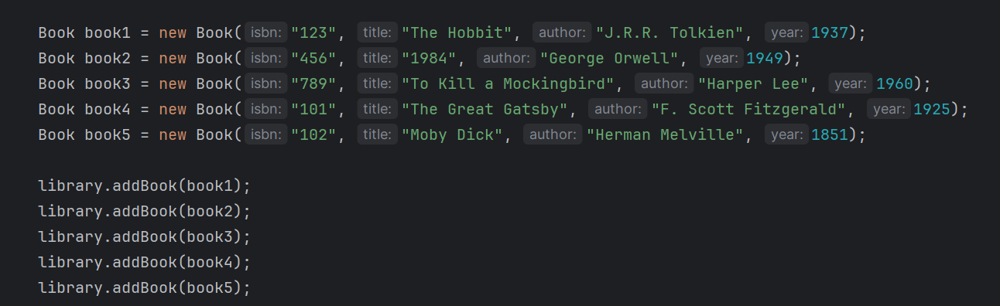
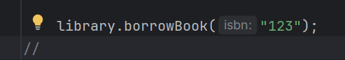
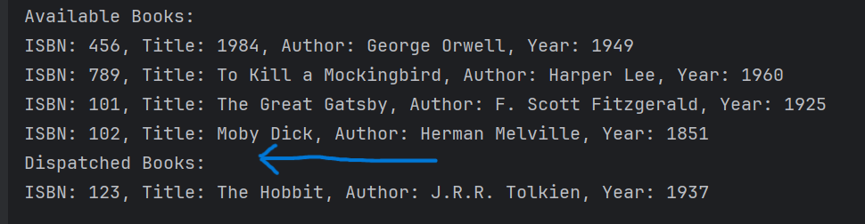
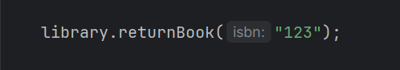
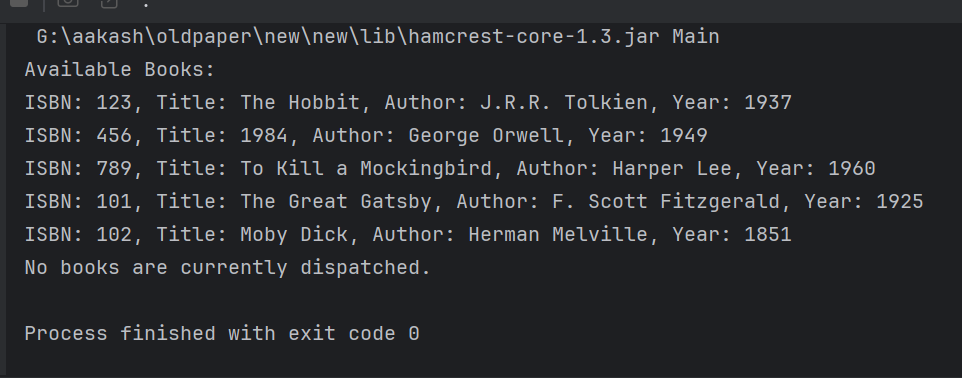
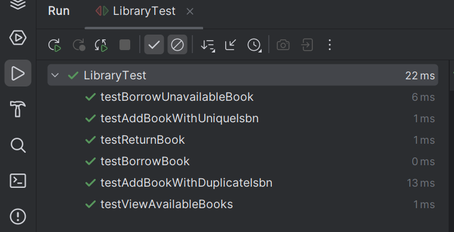

# Incubyte
# Library Management System

## Overview

This project implements a simple library management system that allows users to perform basic operations such as adding books, borrowing books, returning books, viewing available books, and printing all books.

## Features

- **Add Books**: Users can add new books with a unique ISBN, title, author, and publication year.
- **Borrow Books**: Users can borrow available books. The system ensures books are available before borrowing.
- **Return Books**: Users can return borrowed books, updating their availability.
- **View Available Books**: Users can view a list of all available books.
- **Print All Books**: Users can print all books.

## Project Structure

- `Library.java`: The main class containing the library management system's functionality.
- `Book.java`: The class representing a book with attributes like ISBN, title, author, and publication year.
- `LibraryTest.java`: Contains JUnit tests for verifying the functionality of the library management system.
- `Main.java`: The File is use to run this project

## Getting Started

### Prerequisites

- Java 8 or later
- Maven (for dependency management)
- JUnit (for testing)

### Setup

1. **Clone the Repository**:

    ```sh
    git clone <repository-url>
    cd Incubyte
    ```

2. **Build the Project**:

    Use Maven to build the project:

    ```sh
    mvn clean install
    ```

3. **Run Tests**:

    To ensure everything is working correctly, run the tests:

    ```sh
    mvn test
    ```

4. **Run the Project**:

    You can run the project by executing the main class if you have set up a main method (not included in the current implementation).

## Usage

### Adding Books

Create a `Library` object and use the `addBook` method to add books:









